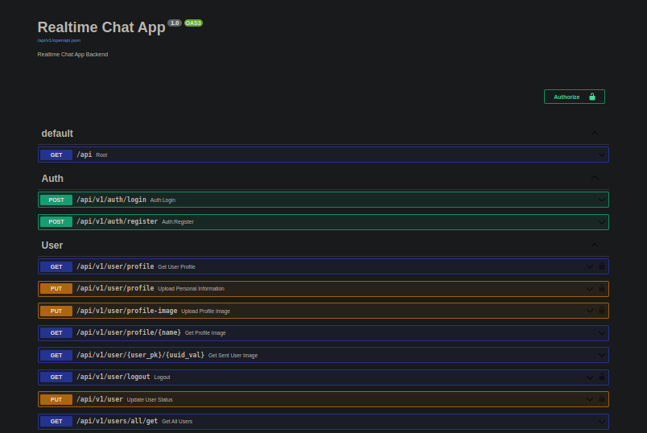
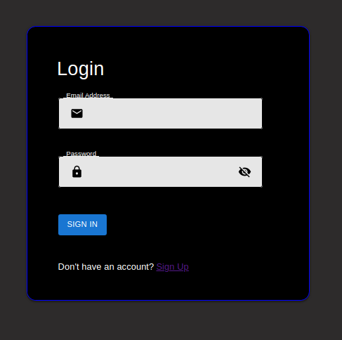

# A fully featured chat app built using the FARR stack.

Chat is a blazingly fast full stack chat application developed using React, MUI, Redux, FastAPI, Redis, and friends. It's designed to be developer-friendly, with code that is both standards-compliant and optimised for performance. As well as being feature-rich, this chat application is also fully responsive, meaning it will work seamlessly on a range of devices. So whether you're chatting on your desktop or your mobile, you'll always have a great experience.

This chat application contain a handful list of reusable components.

[Insert app screenshots](https://docs.github.com/en/get-started/writing-on-github/getting-started-with-writing-and-formatting-on-github/basic-writing-and-formatting-syntax#uploading-assets)

## How it works


### How the data is stored:

The data is stored in a redis database through the [redis-om-python](https://github.com/redis/redis-om-python) library.

### How the data is accessed:

The data is accessed through various FastAPI endpoints which you can access after running the server-side FastAPI app at [http://localhost:8000](http://localhost:8000) or the docs deployed on [Herocku](https://fastapi-herock.herokuapp.com/docs#/).

## How to run it locally?

### Running the server-side FastAPI app.

- Fork/Clone the repo:

```sh
$ git clone git@github.com:wiseaidev/chat.git
```

- Navigate to the backend folder and run the server on one terminal:

```sh
$ cd chat/backend
$ python3.9 -m venv .venv
$ source .venv/bin/activate
(.venv)$ make install

or

(.venv)$ poetry install
```

Now you can run the project locally:

```sh
(.venv)$ make run

or

(.venv)$ poetry run server
```

You can navigate to [http://localhost:8000](http://localhost:8000) to access the Swagger documentation.



### Running the client-side React app.

- Navigate to the frontend folder and run the server on one terminal:

```sh
$ cd chat/frontend
$ npm install
$ npm start
```

Now, you can navigate to [http://localhost:3000](http://localhost:3000) to interact with the app.



For a complete wakthrought on how to use this app, you can refer to [this page](https://chat-docs.wiseai.dev/demo) of the official docs.

### Local installation & Prerequisites

For the frontend part, you can refer to [this section](https://chat-docs.wiseai.dev/installation) of the docs.

For the backend part, you can refer to [this section](https://chat-docs.wiseai.dev/backend-installation) of the docs.

## Deployment

To make deploys work, you need to create free account on [Redis Cloud](https://redis.info/try-free-dev-to)

### Google Cloud Run

TODO

### Heroku

TODO

### Netlify

TODO

### Vercel

TODO

## More Information about Redis Stack

Here some resources to help you quickly get started using Redis Stack. If you still have questions, feel free to ask them in the [Redis Discord](https://discord.gg/redis) or on [Twitter](https://twitter.com/redisinc).

### Getting Started

1. Sign up for a [free Redis Cloud account using this link](https://redis.info/try-free-dev-to) and use the [Redis Stack database in the cloud](https://developer.redis.com/create/rediscloud).
1. Based on the language/framework you want to use, you will find the following client libraries:
    - [Redis OM .NET (C#)](https://github.com/redis/redis-om-dotnet)
        - Watch this [getting started video](https://www.youtube.com/watch?v=ZHPXKrJCYNA)
        - Follow this [getting started guide](https://redis.io/docs/stack/get-started/tutorials/stack-dotnet/)
    - [Redis OM Node (JS)](https://github.com/redis/redis-om-node)
        - Watch this [getting started video](https://www.youtube.com/watch?v=KUfufrwpBkM)
        - Follow this [getting started guide](https://redis.io/docs/stack/get-started/tutorials/stack-node/)
    - [Redis OM Python](https://github.com/redis/redis-om-python)
        - Watch this [getting started video](https://www.youtube.com/watch?v=PPT1FElAS84)
        - Follow this [getting started guide](https://redis.io/docs/stack/get-started/tutorials/stack-python/)
    - [Redis OM Spring (Java)](https://github.com/redis/redis-om-spring)
        - Watch this [getting started video](https://www.youtube.com/watch?v=YhQX8pHy3hk)
        - Follow this [getting started guide](https://redis.io/docs/stack/get-started/tutorials/stack-spring/)

The above videos and guides should be enough to get you started in your desired language/framework. From there you can expand and develop your app. Use the resources below to help guide you further:

1. [Developer Hub](https://redis.info/devhub) - The main developer page for Redis, where you can find information on building using Redis with sample projects, guides, and tutorials.
1. [Redis Stack getting started page](https://redis.io/docs/stack/) - Lists all the Redis Stack features. From there you can find relevant docs and tutorials for all the capabilities of Redis Stack.
1. [Redis Rediscover](https://redis.com/rediscover/) - Provides use-cases for Redis as well as real-world examples and educational material
1. [RedisInsight - Desktop GUI tool](https://redis.info/redisinsight) - Use this to connect to Redis to visually see the data. It also has a CLI inside it that lets you send Redis CLI commands. It also has a profiler so you can see commands that are run on your Redis instance in real-time
1. Youtube Videos
    - [Official Redis Youtube channel](https://redis.info/youtube)
    - [Redis Stack videos](https://www.youtube.com/watch?v=LaiQFZ5bXaM&list=PL83Wfqi-zYZFIQyTMUU6X7rPW2kVV-Ppb) - Help you get started modeling data, using Redis OM, and exploring Redis Stack
    - [Redis Stack Real-Time Stock App](https://www.youtube.com/watch?v=mUNFvyrsl8Q) from Ahmad Bazzi
    - [Build a Fullstack Next.js app](https://www.youtube.com/watch?v=DOIWQddRD5M) with Fireship.io
    - [Microservices with Redis Course](https://www.youtube.com/watch?v=Cy9fAvsXGZA) by Scalable Scripts on freeCodeCamp